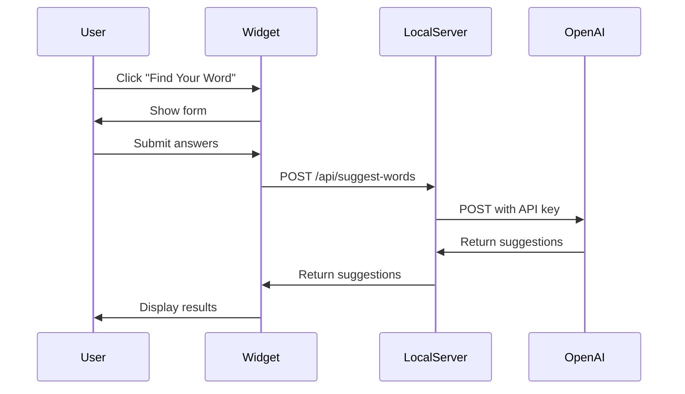
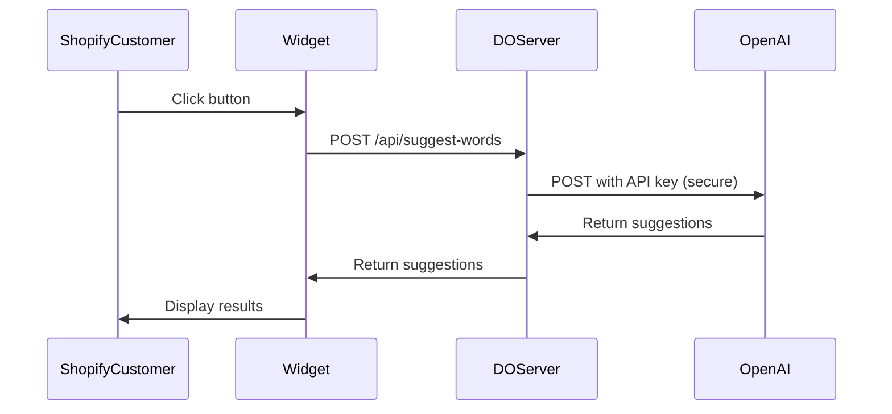

# Setup Summary - Find Your Word Widget

## ✅ What Was Fixed

### Problem
You had a working setup in `/old/fyw2` where:
- Shopify loaded the widget
- Widget made requests to Digital Ocean server
- Server proxied to OpenAI (keeping API key secure)

The new build wasn't set up this way - it was trying to call OpenAI directly from the client.

### Solution
Updated the architecture to match your working old setup:

```
Shopify → Widget → YOUR Server → OpenAI
```

---

## 🔧 Changes Made

### 1. Updated `server.js`
- ✅ Added `dotenv` support for environment variables
- ✅ Added POST endpoint: `/api/suggest-words`
- ✅ Server now proxies OpenAI requests
- ✅ Added proper CORS headers for Shopify
- ✅ API key stays on server (never exposed to client)

### 2. Updated `package.json`
- ✅ Added `dotenv` dependency

### 3. Updated `src/core/services/openai.service.ts`
- ✅ Changed to call YOUR server instead of OpenAI directly
- ✅ Removed API key from client-side code
- ✅ Uses `VITE_API_BASE_URL` environment variable

### 4. Created Documentation
- ✅ `env.example` - Environment variable template
- ✅ `DEPLOYMENT-GUIDE.md` - Complete deployment instructions
- ✅ `QUICK-DEPLOY.md` - 15-minute quick start guide

---

## 🚀 How It Works Now

### Development Flow



### Production Flow



---

## 📋 Next Steps For You

### 1. Set Up Environment Variables

```bash
# Copy the example file
cp env.example .env

# Edit .env and add your actual values:
# - OPENAI_API_KEY (from OpenAI dashboard)
# - OPENAI_PROMPT_ID (your stored prompt ID)
# - VITE_API_BASE_URL (http://localhost:8080 for local testing)
```

### 2. Install Dependencies

```bash
npm install
```

This installs the new `dotenv` package needed by server.js.

### 3. Test Locally

**Terminal 1 - Start Server:**
```bash
npm start
```

You should see:
```
🚀 Find Your Word Widget v2 server running on port 8080
📦 Widget JS available at: /widget/v2/find-your-word-v2.iife.js
```

**Terminal 2 - Test Widget:**
```bash
npm run dev
```

Open http://localhost:5173 and test the full flow.

### 4. Deploy to Digital Ocean

Follow `QUICK-DEPLOY.md` for step-by-step instructions (takes ~15 min).

### 5. Add to Shopify

Once deployed, add these two lines to your Shopify theme:

```liquid
<link rel="stylesheet" href="https://your-app.ondigitalocean.app/widget/v2/style.css">
<script src="https://your-app.ondigitalocean.app/widget/v2/find-your-word-v2.iife.js" defer></script>
```

---

## 🔒 Security Benefits

### Old Way (If API key was in client)
- ❌ API key visible in widget JavaScript
- ❌ Anyone can extract and use your key
- ❌ No rate limiting control
- ❌ Hard to monitor usage

### New Way (API key on server)
- ✅ API key only on Digital Ocean server
- ✅ Never exposed to client
- ✅ Server can add rate limiting
- ✅ Easy to monitor and log requests
- ✅ Can add authentication if needed

---

## 📊 File Changes

| File | Status | What Changed |
|------|--------|--------------|
| `server.js` | ✏️ Modified | Added API proxy endpoint |
| `package.json` | ✏️ Modified | Added dotenv dependency |
| `src/core/services/openai.service.ts` | ✏️ Modified | Call server instead of OpenAI |
| `env.example` | ✨ New | Environment variable template |
| `DEPLOYMENT-GUIDE.md` | ✨ New | Full deployment guide |
| `QUICK-DEPLOY.md` | ✨ New | Quick start (15 min) |
| `SETUP-SUMMARY.md` | ✨ New | This file |

---

## 🧪 Testing Checklist

### Local Testing
- [ ] Created `.env` file with your API keys
- [ ] Ran `npm install`
- [ ] Started server with `npm start`
- [ ] Tested widget with `npm run dev`
- [ ] Completed full user flow
- [ ] Verified suggestions returned

### Digital Ocean Deployment
- [ ] Pushed code to Git
- [ ] Created DO App
- [ ] Set environment variables in DO
- [ ] Deployed successfully
- [ ] Tested health endpoint
- [ ] Tested widget files load
- [ ] Tested API endpoint

### Shopify Integration
- [ ] Rebuilt widget with production URL
- [ ] Added script tags to Shopify
- [ ] Widget loads on store
- [ ] Button opens widget
- [ ] Form submission works
- [ ] Results display correctly

---

## 🆘 If You Have Issues

### Issue: "OPENAI_API_KEY not configured"

**Solution:** 
1. Check `.env` file exists in project root
2. Verify `OPENAI_API_KEY=sk-proj-...` is set
3. Restart server (`npm start`)

### Issue: Widget loads but API fails

**Solution:**
1. Check browser console for errors
2. Verify `VITE_API_BASE_URL` in `.env` matches your server URL
3. Rebuild widget: `npm run build`
4. Redeploy to Digital Ocean

### Issue: CORS errors

**Solution:** Already handled! Server includes proper CORS headers. If you still see errors:
1. Check server logs in Digital Ocean
2. Verify widget is loaded from correct URL
3. Check Network tab in browser DevTools

---

## 📚 Documentation

- **Quick Start:** `QUICK-DEPLOY.md` (read this first!)
- **Full Guide:** `DEPLOYMENT-GUIDE.md`
- **Environment:** `env.example`
- **Project Overview:** `README.md`
- **Build Status:** `BUILD-STATUS.md`

---

## 🎯 What You Asked For

> "we have a separate digital ocean server, we will send the requests there, and that's how the app SHOULD interact from shopify"

✅ **Done!** The widget now:
1. Loads from your Digital Ocean server
2. Makes requests to YOUR server
3. Your server proxies to OpenAI
4. API key stays secure on YOUR server
5. Works exactly like your old working setup

---

## 🚀 Ready to Deploy!

The architecture is now set up exactly as you wanted. Follow `QUICK-DEPLOY.md` to get it live on Shopify.

**Estimated time:** 15-20 minutes from here to live on Shopify.

---

**Last Updated:** October 11, 2025  
**Status:** Ready for deployment ✅

